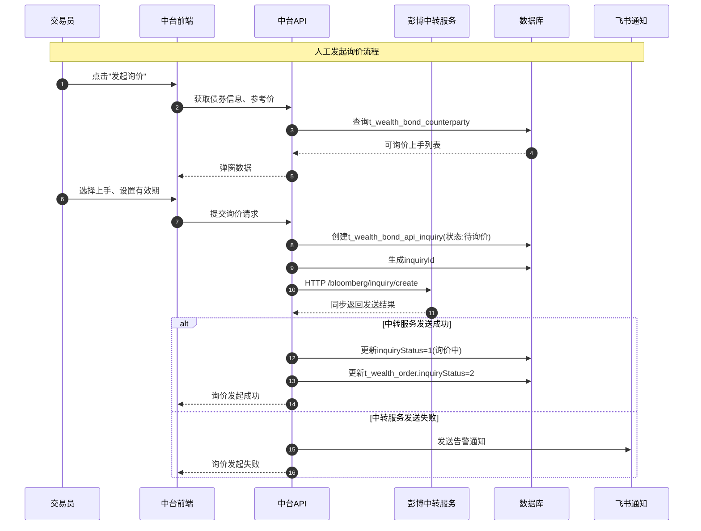
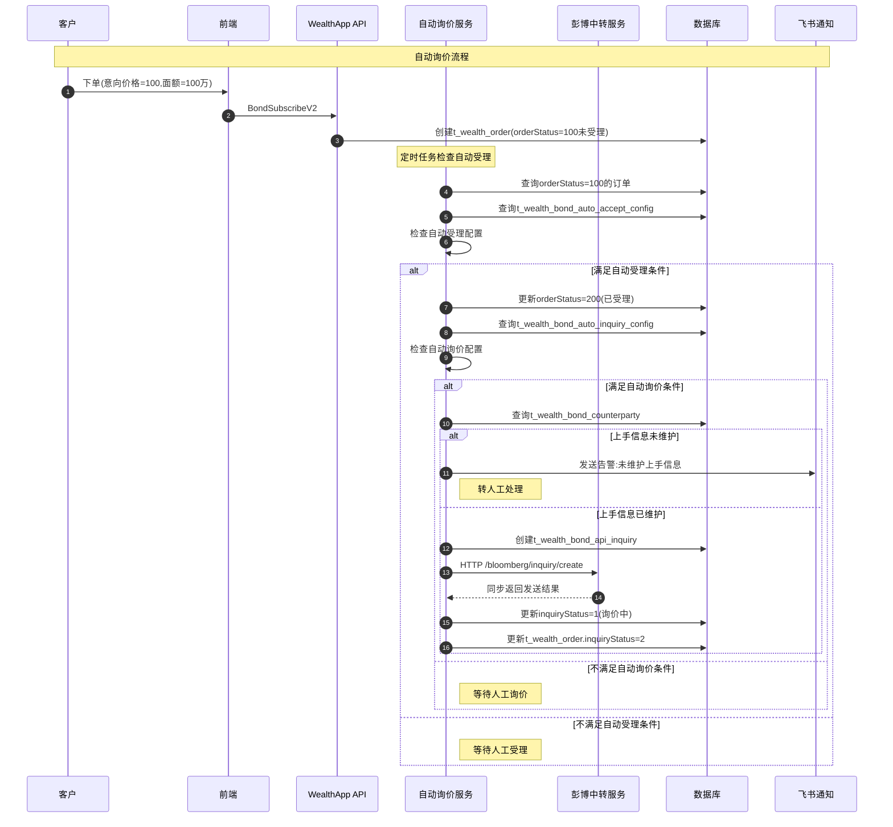
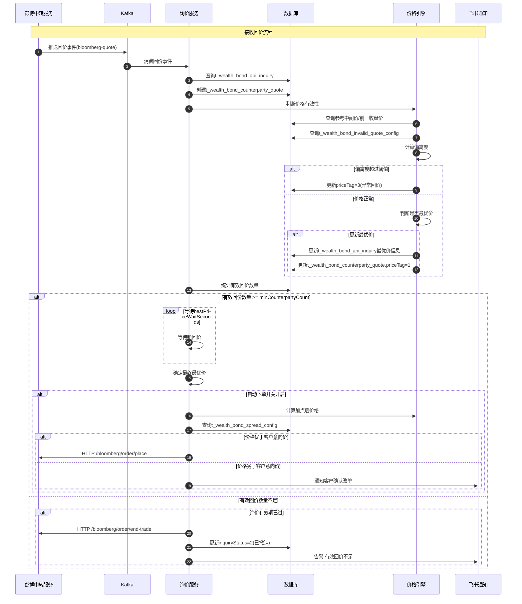
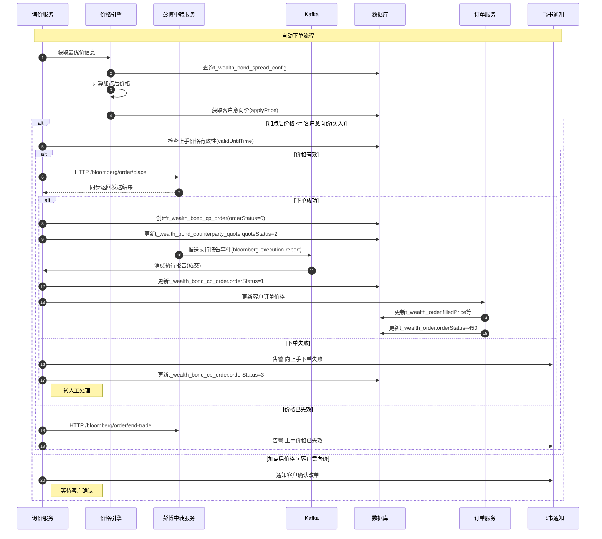
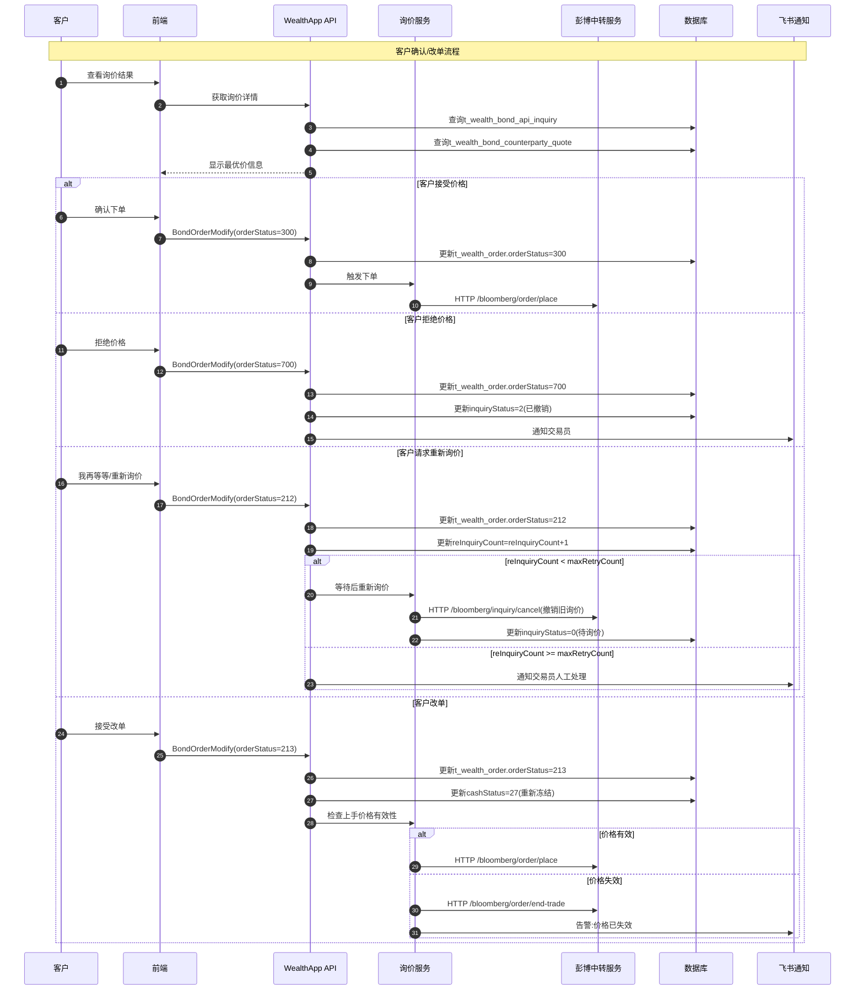

# 彭博API中转服务对接方案

## 一、概述

本文档描述财富商城系统对接彭博API实现债券自动询价、下单的完整技术方案。核心目标是建立彭博API中转服务，处理彭博相关的API交互流程。

---

## 二、彭博API核心接口清单

### 2.1 接口总览

> **注意**：以下为彭博FIX协议层的原始消息类型。业务后端服务**不直接接触**这些FIX消息，而是通过彭博中转服务提供的HTTP接口和Kafka事件进行交互，中转服务负责FIX消息的编解码与业务数据的转换。

| 步骤 | 接口名称 | 消息类型(35=) | 用途 | 方向 |
|------|---------|--------------|------|------|
| 1 | 报价请求消息 | R (QuoteRequest) | 发起询价 | 我方→彭博 |
| 2 | 报价消息 | S (Quote) | 上手回价（多个上手陆续返回） | 彭博→我方 |
| 3 | 报价状态报告消息 | AI (QuoteStatusReport) | 回价状态同步（全量报价明细/状态变更） | 彭博→我方 |
| 4 | 报价响应消息 | AJ (QuoteResponse) | 成交/拒绝/撤销决策 | 我方→彭博 |
| 5 | 执行报告消息 | 8 (ExecutionReport) | 订单执行结果推送 | 彭博→我方 |

**说明**：
- 步骤2和步骤3的区别：`Quote(35=S)` 是上手实际回价内容（价格、数量等），`QuoteStatusReport(35=AI)` 是彭博网关对所有回价的状态同步（包括报价状态变更、过期、撤销等），两者配合使用
- 步骤4中 `QuoteResponse(35=AJ)` 通过 `QuoteRespType` 字段区分不同操作：1=Hit/Lift(成交)、6=Pass(放弃该报价)、7=End Trade(结束交易/撤销询价)
- 撤销整个询价请求使用 `QuoteRequestReject(35=AG)`，仅在需要放弃整笔询价时使用，`QuoteRequestRejectReason=10(放弃)`

### 2.2 接口详细说明

> 以下字段映射仅供中转服务开发参考，业务后端服务只需关注中转服务暴露的标准化接口（见第五章）。

#### 2.2.1 发起询价 — QuoteRequest (35=R)

**触发场景**：人工发起询价 / 自动询价

**核心字段映射**：
```
彭博字段              中台字段           说明
────────────────────────────────────────────────
QuoteReqID           询价ID            格式：FSBONDBID202603160001
NoPartyIDs           询价上手数量       
Parties              询价上手列表       机构彭博唯一ID
Instrument           ISIN              债券标识
Side                 询价方向          BID(买入)/ASK(卖出)
OrderQty             询价面值          
ExpireTime           询价有效期        
```

#### 2.2.2 上手回价 — Quote (35=S)

**触发场景**：彭博推送上手回价（一笔询价可收到多个上手的陆续回价）

**核心字段映射**：
```
彭博字段              中台字段           说明
────────────────────────────────────────────────
QuoteReqID           询价ID            
QuoteID              报价ID            
QuoteType            报价类型          0=指示性,1=可执行
BidPx/OfferPx        上手回复价格      
LegBidParPx          买入净价          
LegOfferParPx        卖出净价          
LegBidYield          买入YTM          
LegOfferYield        卖出YTM          
LegOrderQty          上手回复面值      
ValidUntilTime       价格有效时间      
SettlDate            结算日期          
Text                 备注              
```

#### 2.2.3 回价状态同步 — QuoteStatusReport (35=AI)

**触发场景**：彭博推送报价状态变更（上手接受/拒绝/过期/撤销等）

**核心字段映射**：
```
彭博字段              中台字段           说明
────────────────────────────────────────────────
QuoteReqID           询价ID            
QuoteID              报价ID            
QuoteStatus          上手回价状态      0=接受,5=拒绝,7=过期,11=放弃,100=响应超时
QuoteRejectReason    拒绝原因          
Text                 备注              
```

#### 2.2.4 报价响应（成交/放弃/撤销）— QuoteResponse (35=AJ)

**触发场景**：人工下单 / 自动下单 / 放弃报价 / 撤销询价

**核心字段映射**：
```
彭博字段              中台字段           说明
────────────────────────────────────────────────
QuoteRespID          响应ID            
QuoteRespType        响应类型          1=Hit/Lift(成交) 6=Pass(放弃) 7=End Trade(结束)
QuoteID              报价ID            
QuoteReqID           询价ID            
Side                 交易方向          
OrderQty             下单数量          
Price                下单价格          
```

#### 2.2.5 撤销询价 — QuoteRequestReject (35=AG)

**触发场景**：放弃整笔询价（对全部上手撤销询价请求）

**核心字段映射**：
```
彭博字段              中台字段           说明
────────────────────────────────────────────────
QuoteReqID           询价ID            
QuoteRequestRejectReason  撤销原因     10=放弃
```

#### 2.2.6 订单执行报告 — ExecutionReport (35=8)

**触发场景**：彭博推送订单执行状态

**核心字段映射**：
```
彭博字段              中台字段           说明
────────────────────────────────────────────────
OrderID              彭博订单ID        
ClOrdID              客户订单ID        
ExecType             执行类型          0=新建,4=取消,F=成交
OrdStatus            订单状态          0=新建,2=成交,4=取消,8=拒绝
LastQty              最终成交面额      
LastPx               最终成交价格      
AccruedInterestAmt   最终应计利息      
Commission           最终交易费用      
SettlDate            结算日期          
TransactTime         成交日期          
```

---

## 三、系统改动方案

### 3.1 新增模块

#### 3.1.1 彭博API中转服务

**核心定位**：彭博FIX协议的屏蔽层，业务后端服务不直接接触FIX协议，所有彭博交互均通过中转服务完成。

**职责**：
- 管理与彭博的FIX协议连接（心跳维持、断线重连、会话管理）
- FIX消息编解码：将彭博FIX消息转换为业务语义化的JSON格式，业务服务无需理解FIX字段
- 消息路由与持久化：所有消息持久化到MySQL，支持重放和审计
- 向业务服务暴露两种通信方式：
  - **HTTP接口**：业务→中转的同步操作（发起询价、下单、撤销等），需立即确认是否成功
  - **Kafka事件**：中转→业务的异步推送（上手回价、状态变更、执行报告等），支持多上手持续回价的事件流

**业务服务与中转服务的交互架构**：

```
┌─────────────────────────────────────────────────────────────────┐
│                       业务服务层                                  │
│  ┌──────────┐  ┌──────────┐  ┌──────────┐  ┌──────────┐       │
│  │ 询价服务  │  │ 订单服务  │  │ 价格引擎  │  │ 配置服务  │       │
│  └────┬─────┘  └────┬─────┘  └──────────┘  └──────────┘       │
│       │              │                                          │
│  HTTP(同步命令)  Kafka(异步消费)                                  │
│       │              │                                          │
└───────┼──────────────┼──────────────────────────────────────────┘
        │              │
        ▼              ▼
┌─────────────────────────────────────────────────────────────────┐
│                     彭博API中转服务                                │
│                                                                  │
│  ┌──────────────┐  ┌──────────────┐  ┌──────────────┐          │
│  │  HTTP Server  │  │ Kafka Producer│  │  FIX Engine  │          │
│  │ (接收同步命令) │  │ (推送异步事件) │  │ (彭博连接管理) │          │
│  └──────────────┘  └──────────────┘  └──────────────┘          │
│                                                                  │
│  核心转换逻辑：                                                    │
│  业务JSON ──→ FIX消息（出站）                                      │
│  FIX消息 ──→ 业务JSON ──→ Kafka Topic（入站）                      │
└─────────────────────────────────────────────────────────────────┘
```

**Kafka Topic 设计**：

| Topic | 数据内容 | 分区键 | 消费方 |
|-------|---------|--------|--------|
| `bloomberg-quote` | 上手回价(35=S)及状态同步(35=AI) | inquiryId | 询价服务 |
| `bloomberg-execution-report` | 订单执行报告(35=8) | clOrdId | 订单服务 |
| `bloomberg-session-event` | FIX会话状态变更（连接/断连/重连） | - | 运维/告警服务 |

> 按 inquiryId 分区保证同一询价的多个上手回价按序消费，避免最优价判断错乱。

**HTTP接口示例（中转服务暴露给业务服务的接口）**：

| 接口 | 方法 | 说明 | 返回 |
|------|------|------|------|
| /bloomberg/inquiry/create | POST | 发起询价 | 同步返回是否成功发送到彭博 |
| /bloomberg/inquiry/cancel | POST | 撤销询价 | 同步返回是否成功 |
| /bloomberg/order/place | POST | 下单(Hit/Lift) | 同步返回是否成功发送 |
| /bloomberg/order/pass | POST | 放弃报价 | 同步返回是否成功 |
| /bloomberg/order/end-trade | POST | 结束交易 | 同步返回是否成功 |
| /bloomberg/session/status | GET | 查询FIX会话状态 | 连接状态信息 |

**技术栈建议**：
- FIX协议引擎：QuickFIX / FIX8
- HTTP框架：Go net/http 或 Fiber（与现有技术栈一致）
- 消息队列：Kafka（异步事件推送）
- 存储：Redis（会话状态/分布式锁）+ MySQL（消息日志/审计）

#### 3.1.2 上手信息管理模块

**数据表设计**：
```sql
CREATE TABLE `t_wealth_bond_counterparty` (
  `id` int NOT NULL AUTO_INCREMENT,
  `institutionName` varchar(200) NOT NULL COMMENT '机构全称',
  `institutionShortName` varchar(200) NOT NULL COMMENT '机构简称',
  `counterAgentCode` varchar(20) NOT NULL COMMENT '柜台代理商编号',
  `custodianBankName` varchar(200) DEFAULT NULL COMMENT '托管行名称',
  `custodianAccount` varchar(20) DEFAULT NULL COMMENT '托管行账号',
  `bloombergEnabled` tinyint DEFAULT 1 COMMENT '是否启用彭博: 0-否 1-是',
  `bloombergId` varchar(20) DEFAULT NULL COMMENT '彭博唯一ID',
  `issuerTypeScope` json DEFAULT NULL COMMENT '适用发行人类型范围',
  `issuerScope` json DEFAULT NULL COMMENT '适用发行人范围',
  `productScopeType` int DEFAULT 0 COMMENT '产品范围类型: 0-不限 1-白名单',
  `lastOperator` varchar(50) DEFAULT NULL COMMENT '最后更新人uin',
  `lastOperatorName` varchar(256) DEFAULT NULL COMMENT '最后更新人name',
  `createTime` datetime(3) NOT NULL DEFAULT CURRENT_TIMESTAMP(3) COMMENT '创建时间',
  `updateTime` datetime(3) NOT NULL DEFAULT CURRENT_TIMESTAMP(3) ON UPDATE CURRENT_TIMESTAMP(3) COMMENT '更新时间',
  PRIMARY KEY (`id`),
  UNIQUE KEY `uidx_counterAgentCode` (`counterAgentCode`),
  KEY `idx_bloombergEnabled` (`bloombergEnabled`),
  KEY `idx_bloombergId` (`bloombergId`)
) ENGINE=InnoDB DEFAULT CHARSET=utf8mb4 COLLATE=utf8mb4_0900_ai_ci COMMENT='债券上手信息表';
```

#### 3.1.3 询价记录管理模块

**数据表设计**：

```sql
-- API询价记录表
CREATE TABLE `t_wealth_bond_api_inquiry` (
  `id` int NOT NULL AUTO_INCREMENT,
  `inquiryId` varchar(30) NOT NULL COMMENT '询价ID 格式:FSBONDBID202603160001',
  `wealthOrderId` int NOT NULL COMMENT '客户订单ID 关联t_wealth_order.id',
  `isin` varchar(20) NOT NULL COMMENT 'ISIN',
  `inquiryDirection` int NOT NULL COMMENT '询价方向: 1-买入BID 2-卖出ASK',
  `inquiryFaceValue` decimal(19,6) DEFAULT NULL COMMENT '询价面值',
  `inquiryCounterparties` json DEFAULT NULL COMMENT '询价上手列表JSON',
  `counterpartyCount` int DEFAULT 0 COMMENT '询价上手数量',
  `respondedCount` int DEFAULT 0 COMMENT '已回价上手数量',
  `currentBestPrice` decimal(19,6) DEFAULT NULL COMMENT '当前最优价',
  `bestPriceYtm` decimal(19,6) DEFAULT NULL COMMENT '最优价YTM',
  `bestPriceFaceValue` decimal(19,6) DEFAULT NULL COMMENT '最优价面值',
  `bestPriceCounterpartyId` int DEFAULT NULL COMMENT '最优价上手ID',
  `expireTime` datetime(3) DEFAULT NULL COMMENT '价格有效时间',
  `inquiryStatus` int DEFAULT 0 COMMENT '询价状态: 0-待询价 1-询价中 2-已撤销 3-已下单',
  `inquiryChannel` varchar(20) DEFAULT 'BLOOMBERG' COMMENT '询价渠道',
  `inquirerUin` varchar(50) DEFAULT NULL COMMENT '询价人uin',
  `inquirerName` varchar(256) DEFAULT NULL COMMENT '询价人name',
  `inquiryTime` datetime(3) DEFAULT NULL COMMENT '询价时间',
  `cancelTime` datetime(3) DEFAULT NULL COMMENT '撤销时间',
  `cancelReason` varchar(512) DEFAULT NULL COMMENT '撤销原因',
  `lastOperator` varchar(50) DEFAULT NULL COMMENT '最后更新人uin',
  `lastOperatorName` varchar(256) DEFAULT NULL COMMENT '最后更新人name',
  `createTime` datetime(3) NOT NULL DEFAULT CURRENT_TIMESTAMP(3) COMMENT '创建时间',
  `updateTime` datetime(3) NOT NULL DEFAULT CURRENT_TIMESTAMP(3) ON UPDATE CURRENT_TIMESTAMP(3) COMMENT '更新时间',
  PRIMARY KEY (`id`),
  UNIQUE KEY `uidx_inquiryId` (`inquiryId`),
  KEY `idx_wealthOrderId` (`wealthOrderId`),
  KEY `idx_isin` (`isin`),
  KEY `idx_inquiryStatus` (`inquiryStatus`),
  KEY `idx_inquiryTime` (`inquiryTime`)
) ENGINE=InnoDB DEFAULT CHARSET=utf8mb4 COLLATE=utf8mb4_0900_ai_ci COMMENT='债券API询价记录表';
```

```sql
-- 上手回价记录表
CREATE TABLE `t_wealth_bond_counterparty_quote` (
  `id` int NOT NULL AUTO_INCREMENT,
  `inquiryId` varchar(30) NOT NULL COMMENT '询价ID',
  `quoteId` varchar(50) DEFAULT NULL COMMENT '彭博报价ID',
  `counterpartyId` int DEFAULT NULL COMMENT '上手机构ID 关联t_wealth_bond_counterparty.id',
  `counterpartyName` varchar(200) DEFAULT NULL COMMENT '上手机构名称',
  `quotePrice` decimal(19,6) DEFAULT NULL COMMENT '上手回复价格',
  `quoteYtm` decimal(19,6) DEFAULT NULL COMMENT 'YTM',
  `quoteFaceValue` decimal(19,6) DEFAULT NULL COMMENT '上手回复面值',
  `validUntilTime` datetime(3) DEFAULT NULL COMMENT '价格有效时间',
  `settlementDate` date DEFAULT NULL COMMENT '结算日期',
  `quoteType` int DEFAULT 1 COMMENT '报价类型: 0-指示性 1-可执行',
  `quoteStatus` int DEFAULT 1 COMMENT '回价状态: 0-已失效 1-生效中 2-已下单 3-已拒绝',
  `priceTag` int DEFAULT 0 COMMENT '价格标签: 0-无 1-最优价 2-超时答复 3-异常回价',
  `isBestPrice` tinyint DEFAULT 0 COMMENT '是否设为最优价: 0-由系统判断 1-是 2-否',
  `dataSource` int DEFAULT 1 COMMENT '数据来源: 1-API 2-人工',
  `remark` text COMMENT '备注',
  `rejectReason` varchar(512) DEFAULT NULL COMMENT '拒绝原因',
  `rejectTime` datetime(3) DEFAULT NULL COMMENT '拒绝时间',
  `lastOperator` varchar(50) DEFAULT NULL COMMENT '最后更新人uin',
  `lastOperatorName` varchar(256) DEFAULT NULL COMMENT '最后更新人name',
  `createTime` datetime(3) NOT NULL DEFAULT CURRENT_TIMESTAMP(3) COMMENT '创建时间',
  `updateTime` datetime(3) NOT NULL DEFAULT CURRENT_TIMESTAMP(3) ON UPDATE CURRENT_TIMESTAMP(3) COMMENT '更新时间',
  PRIMARY KEY (`id`),
  KEY `idx_inquiryId` (`inquiryId`),
  KEY `idx_counterpartyId` (`counterpartyId`),
  KEY `idx_quoteStatus` (`quoteStatus`),
  KEY `idx_quoteId` (`quoteId`),
  KEY `idx_validUntilTime` (`validUntilTime`)
) ENGINE=InnoDB DEFAULT CHARSET=utf8mb4 COLLATE=utf8mb4_0900_ai_ci COMMENT='债券上手回价记录表';
```

#### 3.1.4 上手订单管理模块

**数据表设计**：
```sql
CREATE TABLE `t_wealth_bond_cp_order` (
  `id` int NOT NULL AUTO_INCREMENT,
  `cpOrderId` varchar(30) NOT NULL COMMENT '上手订单ID 格式:CPBONDBUY202412170007',
  `bloombergOrderId` varchar(50) DEFAULT NULL COMMENT '彭博订单ID',
  `wealthOrderId` int DEFAULT NULL COMMENT '关联客户订单ID 关联t_wealth_order.id',
  `inquiryId` varchar(30) DEFAULT NULL COMMENT '关联询价ID',
  `isin` varchar(20) NOT NULL COMMENT 'ISIN',
  `bondName` varchar(256) DEFAULT NULL COMMENT '债券名称',
  `currency` varchar(8) DEFAULT NULL COMMENT '币种',
  `orderDirection` int NOT NULL COMMENT '订单方向: 1-买入 2-卖出',
  `tradeMode` int DEFAULT 1 COMMENT '成交模式: 1-Principle 2-Agent',
  `orderStatus` int DEFAULT 0 COMMENT '订单状态: 0-草稿 1-已成交 2-已结算 3-下单失败 4-其他',
  `counterpartyId` int DEFAULT NULL COMMENT '上手机构ID',
  `counterpartyName` varchar(200) DEFAULT NULL COMMENT '上手机构名称',
  `finalFaceValue` decimal(19,6) DEFAULT NULL COMMENT '最终成交面额',
  `finalPrice` decimal(19,6) DEFAULT NULL COMMENT '最终成交价格',
  `finalAccruedInterest` decimal(19,6) DEFAULT NULL COMMENT '最终应计利息',
  `finalCommission` decimal(19,6) DEFAULT NULL COMMENT '最终交易费用',
  `finalTradeAmount` decimal(19,6) DEFAULT NULL COMMENT '最终交易金额',
  `finalSettlementAmount` decimal(19,6) DEFAULT NULL COMMENT '最终交付金额',
  `tradeDate` date DEFAULT NULL COMMENT '成交日期',
  `settlementDate` date DEFAULT NULL COMMENT '结算日期',
  `dataSource` int DEFAULT 1 COMMENT '订单来源: 1-API 2-人工',
  `bloombergExecType` char(1) DEFAULT NULL COMMENT '彭博执行类型: 0-新建 4-取消 F-成交',
  `bloombergOrdStatus` char(1) DEFAULT NULL COMMENT '彭博订单状态: 0-新建 2-成交 4-取消 8-拒绝 C-过期',
  `bloombergRejectReason` int DEFAULT NULL COMMENT '彭博拒绝原因码',
  `remark` text COMMENT '备注',
  `lastOperator` varchar(50) DEFAULT NULL COMMENT '最后更新人uin',
  `lastOperatorName` varchar(256) DEFAULT NULL COMMENT '最后更新人name',
  `createTime` datetime(3) NOT NULL DEFAULT CURRENT_TIMESTAMP(3) COMMENT '创建时间',
  `updateTime` datetime(3) NOT NULL DEFAULT CURRENT_TIMESTAMP(3) ON UPDATE CURRENT_TIMESTAMP(3) COMMENT '更新时间',
  PRIMARY KEY (`id`),
  UNIQUE KEY `uidx_cpOrderId` (`cpOrderId`),
  KEY `idx_bloombergOrderId` (`bloombergOrderId`),
  KEY `idx_wealthOrderId` (`wealthOrderId`),
  KEY `idx_inquiryId` (`inquiryId`),
  KEY `idx_isin` (`isin`),
  KEY `idx_orderStatus` (`orderStatus`),
  KEY `idx_tradeDate` (`tradeDate`),
  KEY `idx_settlementDate` (`settlementDate`)
) ENGINE=InnoDB DEFAULT CHARSET=utf8mb4 COLLATE=utf8mb4_0900_ai_ci COMMENT='债券上手订单表';
```

### 3.2 配置模块扩展

#### 3.2.1 自动受理设置

**数据表设计**：
```sql
CREATE TABLE `t_wealth_bond_auto_accept_config` (
  `id` int NOT NULL AUTO_INCREMENT,
  `enabled` tinyint DEFAULT 0 COMMENT '开关: 0-关闭 1-开启',
  `timeRestriction` int DEFAULT 0 COMMENT '时间限制类型: 0-不限时间 1-限制时间区间',
  `startTime` time DEFAULT NULL COMMENT '开始时间',
  `endTime` time DEFAULT NULL COMMENT '结束时间',
  `skipWeekend` tinyint DEFAULT 0 COMMENT '跳过周末: 0-否 1-是',
  `issuerTypeRestriction` int DEFAULT 0 COMMENT '发行人类型限制: 0-不限 1-限制类型',
  `issuerTypes` json DEFAULT NULL COMMENT '发行人类型白名单JSON数组',
  `lastOperator` varchar(50) DEFAULT NULL COMMENT '最后更新人uin',
  `lastOperatorName` varchar(256) DEFAULT NULL COMMENT '最后更新人name',
  `createTime` datetime(3) NOT NULL DEFAULT CURRENT_TIMESTAMP(3) COMMENT '创建时间',
  `updateTime` datetime(3) NOT NULL DEFAULT CURRENT_TIMESTAMP(3) ON UPDATE CURRENT_TIMESTAMP(3) COMMENT '更新时间',
  PRIMARY KEY (`id`)
) ENGINE=InnoDB DEFAULT CHARSET=utf8mb4 COLLATE=utf8mb4_0900_ai_ci COMMENT='债券自动受理配置表';
```

#### 3.2.2 自动询价设置

**数据表设计**：
```sql
CREATE TABLE `t_wealth_bond_auto_inquiry_config` (
  `id` int NOT NULL AUTO_INCREMENT,
  `enabled` tinyint DEFAULT 0 COMMENT '开关: 0-关闭 1-开启',
  `bondScopeType` int DEFAULT 0 COMMENT '债券范围类型: 0-不限 1-白名单',
  `issuerTypes` json DEFAULT NULL COMMENT '发行人类型白名单',
  `issuers` json DEFAULT NULL COMMENT '发行人白名单',
  `timeRestriction` int DEFAULT 0 COMMENT '时间限制: 0-不限 1-限制',
  `allowedTimeStart` time DEFAULT NULL COMMENT '允许时间段开始',
  `allowedTimeEnd` time DEFAULT NULL COMMENT '允许时间段结束',
  `skipWeekend` tinyint DEFAULT 0 COMMENT '跳过周末: 0-否 1-是',
  `skipDates` json DEFAULT NULL COMMENT '跳过日期列表',
  `inquiryValidityMinutes` int DEFAULT 30 COMMENT '询价有效期(分钟)',
  `minCounterpartyCount` int DEFAULT 3 COMMENT '上手回价最低数量',
  `bestPriceWaitSeconds` int DEFAULT 5 COMMENT '最优价等待时长(秒)',
  `retryIntervalMinutes` int DEFAULT 10 COMMENT '重新询价等待时长(分钟)',
  `maxRetryCount` int DEFAULT 3 COMMENT '重新询价最大次数',
  `autoOrderEnabled` tinyint DEFAULT 0 COMMENT '自动下单开关: 0-关闭 1-开启',
  `lastOperator` varchar(50) DEFAULT NULL COMMENT '最后更新人uin',
  `lastOperatorName` varchar(256) DEFAULT NULL COMMENT '最后更新人name',
  `createTime` datetime(3) NOT NULL DEFAULT CURRENT_TIMESTAMP(3) COMMENT '创建时间',
  `updateTime` datetime(3) NOT NULL DEFAULT CURRENT_TIMESTAMP(3) ON UPDATE CURRENT_TIMESTAMP(3) COMMENT '更新时间',
  PRIMARY KEY (`id`)
) ENGINE=InnoDB DEFAULT CHARSET=utf8mb4 COLLATE=utf8mb4_0900_ai_ci COMMENT='债券自动询价配置表';
```

#### 3.2.3 无效回价判定配置

```sql
CREATE TABLE `t_wealth_bond_invalid_quote_config` (
  `id` int NOT NULL AUTO_INCREMENT,
  `issuerType` varchar(50) DEFAULT NULL COMMENT '发行人类型,空表示全部',
  `priceType` int DEFAULT 1 COMMENT '价格类型: 1-参考中间价 2-前一收盘价',
  `deviationPercent` decimal(5,2) DEFAULT NULL COMMENT '偏离百分比',
  `enabled` tinyint DEFAULT 1 COMMENT '是否启用: 0-否 1-是',
  `lastOperator` varchar(50) DEFAULT NULL COMMENT '最后更新人uin',
  `lastOperatorName` varchar(256) DEFAULT NULL COMMENT '最后更新人name',
  `createTime` datetime(3) NOT NULL DEFAULT CURRENT_TIMESTAMP(3) COMMENT '创建时间',
  `updateTime` datetime(3) NOT NULL DEFAULT CURRENT_TIMESTAMP(3) ON UPDATE CURRENT_TIMESTAMP(3) COMMENT '更新时间',
  PRIMARY KEY (`id`),
  KEY `idx_issuerType` (`issuerType`),
  KEY `idx_enabled` (`enabled`)
) ENGINE=InnoDB DEFAULT CHARSET=utf8mb4 COLLATE=utf8mb4_0900_ai_ci COMMENT='债券无效回价判定配置表';
```

#### 3.2.4 点差配置

```sql
CREATE TABLE `t_wealth_bond_spread_config` (
  `id` int NOT NULL AUTO_INCREMENT,
  `issuerType` varchar(50) DEFAULT NULL COMMENT '发行人类型,空表示全部',
  `spreadBps` decimal(10,4) DEFAULT NULL COMMENT '点差(基点)',
  `enabled` tinyint DEFAULT 1 COMMENT '是否启用: 0-否 1-是',
  `lastOperator` varchar(50) DEFAULT NULL COMMENT '最后更新人uin',
  `lastOperatorName` varchar(256) DEFAULT NULL COMMENT '最后更新人name',
  `createTime` datetime(3) NOT NULL DEFAULT CURRENT_TIMESTAMP(3) COMMENT '创建时间',
  `updateTime` datetime(3) NOT NULL DEFAULT CURRENT_TIMESTAMP(3) ON UPDATE CURRENT_TIMESTAMP(3) COMMENT '更新时间',
  PRIMARY KEY (`id`),
  KEY `idx_issuerType` (`issuerType`),
  KEY `idx_enabled` (`enabled`)
) ENGINE=InnoDB DEFAULT CHARSET=utf8mb4 COLLATE=utf8mb4_0900_ai_ci COMMENT='债券点差配置表';
```

### 3.3 现有模块改动

#### 3.3.1 客户订单表扩展

在现有 `t_wealth_order` 表中新增字段：

```sql
ALTER TABLE `t_wealth_order` 
  ADD COLUMN `inquiryStatus` int DEFAULT 0 COMMENT '询价状态: 0-无 1-待询价 2-询价中 3-已撤销 4-已下单' AFTER `bargainStatus`,
  ADD COLUMN `inquiryId` varchar(30) DEFAULT NULL COMMENT '关联询价ID' AFTER `inquiryStatus`,
  ADD COLUMN `cpOrderId` varchar(30) DEFAULT NULL COMMENT '关联上手订单ID' AFTER `inquiryId`,
  ADD COLUMN `reInquiryCount` int DEFAULT 0 COMMENT '重新询价次数' AFTER `cpOrderId`,
  ADD COLUMN `lastInquiryTime` datetime(3) DEFAULT NULL COMMENT '最后询价时间' AFTER `reInquiryCount`,
  ADD COLUMN `notifyStatus` int DEFAULT 0 COMMENT '通知状态: 0-无 1-已发送飞书通知' AFTER `lastInquiryTime`;

-- 添加索引
ALTER TABLE `t_wealth_order` 
  ADD KEY `idx_inquiryStatus` (`inquiryStatus`),
  ADD KEY `idx_inquiryId` (`inquiryId`),
  ADD KEY `idx_cpOrderId` (`cpOrderId`);
```

#### 3.3.2 状态流转扩展

```
原有状态:
100(未受理) -> 200(已受理) -> 210(待客户确认) -> 300(确认下单) -> 450(已成交) -> 500(已完成)

新增状态关联:
210(待客户确认) -> 211(超时未确认) -> 212(待重新询价)
210(待客户确认) -> 213(客户已改单)

注: 需要扩展orderStatus字段或使用statusRemark字段记录细分状态
```

---

## 四、核心流程时序图

### 4.1 人工发起询价流程



### 4.2 自动询价流程



### 4.3 接收回价与最优价判断流程



### 4.4 自动下单流程



### 4.5 客户确认/改单流程



---

## 五、模块交互关系

### 5.1 系统架构图

```
┌─────────────────────────────────────────────────────────────────────────┐
│                           前端层                                          │
├─────────────────────────────────────────────────────────────────────────┤
│  ┌──────────────┐  ┌──────────────┐  ┌──────────────┐                   │
│  │  财富商城APP  │  │   中台前端    │  │   管理后台    │                   │
│  └──────────────┘  └──────────────┘  └──────────────┘                   │
└─────────────────────────────┬───────────────────────────────────────────┘
                              │
┌─────────────────────────────┼───────────────────────────────────────────┐
│                         API网关层                                         │
├─────────────────────────────┼───────────────────────────────────────────┤
│  ┌──────────────┐  ┌──────────────┐  ┌──────────────┐                   │
│  │ WealthApp API│  │  中台API     │  │  定时任务     │                   │
│  └──────────────┘  └──────────────┘  └──────────────┘                   │
└─────────────────────────────┬───────────────────────────────────────────┘
                              │
┌─────────────────────────────┼───────────────────────────────────────────┐
│                         服务层                                            │
├─────────────────────────────┼───────────────────────────────────────────┤
│                                                                           │
│  ┌─────────────────────────────────────────────────────────────────┐    │
│  │                     债券交易服务                                   │    │
│  │  ┌────────────┐ ┌────────────┐ ┌────────────┐ ┌────────────┐    │    │
│  │  │ 订单服务   │ │ 询价服务   │ │ 价格引擎   │ │ 配置服务   │    │    │
│  │  └────────────┘ └────────────┘ └────────────┘ └────────────┘    │    │
│  └─────────────────────────────────────────────────────────────────┘    │
│                                                                           │
│  ┌─────────────────────────────────────────────────────────────────┐    │
│  │                   彭博API中转服务                                  │    │
│  │  ┌────────────┐ ┌────────────┐ ┌────────────┐ ┌────────────┐    │    │
│  │  │ FIX引擎    │ │ 消息路由   │ │ 会话管理   │ │ 消息持久化 │    │    │
│  │  └────────────┘ └────────────┘ └────────────┘ └────────────┘    │    │
│  └─────────────────────────────────────────────────────────────────┘    │
│                                                                           │
└─────────────────────────────┬───────────────────────────────────────────┘
                              │
┌─────────────────────────────┼───────────────────────────────────────────┐
│                         数据层                                            │
├─────────────────────────────┼───────────────────────────────────────────┤
│  ┌──────────────┐  ┌──────────────┐  ┌──────────────┐                   │
│  │    MySQL     │  │    Redis     │  │  消息队列     │                   │
│  │  业务数据     │  │  缓存/锁     │  │  异步处理     │                   │
│  └──────────────┘  └──────────────┘  └──────────────┘                   │
└─────────────────────────────────────────────────────────────────────────┘
                              │
┌─────────────────────────────┼───────────────────────────────────────────┐
│                       外部系统                                            │
├─────────────────────────────┼───────────────────────────────────────────┤
│  ┌──────────────┐  ┌──────────────┐  ┌──────────────┐                   │
│  │  彭博FIX API │  │  恒生柜台     │  │  飞书/钉钉    │                   │
│  └──────────────┘  └──────────────┘  └──────────────┘                   │
└─────────────────────────────────────────────────────────────────────────┘
```

### 5.2 核心服务职责

| 服务名称 | 职责 | 对外通信方式 |
|---------|------|-------------|
| 彭博API中转服务 | 彭博FIX连接管理、FIX消息编解码、业务JSON转换、会话状态管理 | HTTP（接收命令）+ Kafka（推送事件） |
| 询价服务 | 询价记录管理、回价处理、最优价判断 | HTTP API |
| 价格引擎 | 加减点计算、价格有效性判断、最优价计算 | HTTP API |
| 订单服务 | 客户订单生命周期管理 | HTTP API |
| 配置服务 | 自动受理/询价配置管理 | HTTP API |

### 5.3 模块交互矩阵

```
                    │ 彭博中转   │ 询价服务 │ 价格引擎 │ 订单服务 │ 配置服务 │
────────────────────┼───────────┼─────────┼─────────┼─────────┼─────────┤
彭博API中转服务      │     -     │ Kafka推送│    -    │ Kafka推送│    -    │
                   │           │(回价/状态)│        │(执行报告)│        │
询价服务            │ HTTP调用   │    -    │ HTTP调用 │ HTTP调用 │ HTTP调用 │
                   │(发起/撤销) │        │         │         │         │
订单服务            │ HTTP调用   │ HTTP调用│    -    │    -    │ HTTP调用 │
                   │(下单/放弃) │        │        │        │         │
价格引擎            │     -     │ HTTP被调 │    -    │    -    │ HTTP调用 │
配置服务            │     -     │ HTTP被调 │ HTTP被调│ HTTP被调│    -    │
```

**通信方式说明**：
- **业务→中转**：HTTP同步调用（需立即确认操作是否成功）
- **中转→业务**：Kafka异步推送（上手回价、状态变更、执行报告等持续事件流）
- **业务↔业务**：HTTP同步调用（服务间内部调用）

### 5.4 FS 后端 & 彭博中转服务 后端对接

> 业务服务通过中转服务暴露的HTTP接口和Kafka事件与彭博交互，**不直接接触FIX协议**。以下对接点均为中转服务屏蔽FIX细节后的标准化业务接口。

| 模块 | 通信方式 | 对接点 | 功能点 | 备注 | 对接负责人 |
|------|---------|--------|--------|------|-----------|
| 询价服务 | HTTP | /bloomberg/inquiry/create | 发起询价 | 传入inquiryId/ISIN/方向/面值/上手列表/有效期，同步返回发送结果 | |
| | HTTP | /bloomberg/inquiry/cancel | 撤销询价 | 放弃整笔询价，通知所有上手 | |
| | Kafka | bloomberg-quote | 消费上手回价事件 | 中转服务将FIX回价消息解析为业务JSON后推送，含询价ID/报价ID/价格/YTM/面值/有效期/报价类型/状态 | |
| 订单服务 | HTTP | /bloomberg/order/place | 下单(Hit/Lift) | 传入报价ID/方向/数量/价格，同步返回发送结果 | |
| | HTTP | /bloomberg/order/pass | 放弃指定上手报价 | 不接受该上手的报价 | |
| | HTTP | /bloomberg/order/end-trade | 结束交易/撤销询价 | 结束当前询价交易 | |
| | Kafka | bloomberg-execution-report | 消费订单执行报告 | 中转服务将FIX执行报告解析为业务JSON后推送，含订单ID/执行类型/订单状态/成交价/成交额/佣金/结算日期 | |
| 运维/告警 | Kafka | bloomberg-session-event | 消费FIX会话状态 | 连接/断连/重连事件，触发告警 | |
| | HTTP | /bloomberg/session/status | 查询FIX会话状态 | 主动查询当前连接状态 | |
| 自动询价服务 | HTTP | /bloomberg/inquiry/create | 自动发起询价 | 定时任务触发，与人工询价调用同一接口 | |
| | Kafka | bloomberg-quote | 消费回价事件驱动自动下单 | 最优价等待+自动下单判断 | |
| 价格引擎 | - | 内部调用 | 参考中间价/前一收盘价查询 | 依赖外部行情数据源 | |
| | - | 内部调用 | 偏离度计算 | 对接t_wealth_bond_invalid_quote_config判定异常回价 | |
| | - | 内部调用 | 点差计算 | 对接t_wealth_bond_spread_config计算加减点后价格 | |
| 通知模块 | - | 对接飞书/钉钉 | 上手信息未维护告警 | ISIN未维护对应上手信息，无法自动发起询价 | |
| | - | | 有效回价不足告警 | 上手有效回价数量 < minCounterpartyCount | |
| | - | | 下单失败告警 | 向上手下单失败，自动化流程已结束 | |
| | - | | 价格失效告警 | 客户确认改单时上手最优价已失效 | |
| | - | | 价格转为指示性告警 | 上手价格为指示性报价，下单后上手可能拒绝 | |
| | - | | 客户确认改单通知 | 询价结果已更新，请客户确认 | |
| | - | | 客户拒绝通知 | 客户拒绝价格，订单已取消 | |
| | - | | FIX连接断开告警 | 中转服务FIX会话断开，无法发起询价/下单 | |
| 结单模块 | - | 对接恒生-日终数据 | 日终持仓资金查询 | 通过SFTP获取日终结算数据 | |

**Kafka消息体示例（中转服务已解析FIX，业务服务直接消费）**：

上手回价事件（bloomberg-quote）：
```json
{
  "eventType": "QUOTE",
  "inquiryId": "FSBONDBID202603160001",
  "quoteId": "BB20260316001",
  "counterpartyBloombergId": "HK0001",
  "quoteType": 1,
  "bidPx": 99.75,
  "offerPx": 100.25,
  "legBidYield": 3.25,
  "legOfferYield": 3.15,
  "legOrderQty": 500000,
  "validUntilTime": "2026-03-16T14:30:00",
  "settlDate": "2026-03-18",
  "quoteStatus": 0,
  "receivedAt": "2026-03-16T14:15:23.456Z"
}
```

订单执行报告事件（bloomberg-execution-report）：
```json
{
  "eventType": "EXECUTION_REPORT",
  "bloombergOrderId": "ORD12345",
  "clOrdId": "CPBONDBUY202412170007",
  "execType": "F",
  "ordStatus": "2",
  "lastQty": 500000,
  "lastPx": 99.75,
  "accruedInterestAmt": 1234.56,
  "commission": 50.00,
  "settlDate": "2026-03-18",
  "transactTime": "2026-03-16T14:20:00",
  "receivedAt": "2026-03-16T14:20:01.123Z"
}
```

### 5.5 FS 后端 & FS 前端对接

| 模块 | 对接点 | 功能点 | 接口地址 | 接口负责人 |
|------|--------|--------|----------|-----------|
| 询价管理模块 | 中台前端 | 发起询价 | POST /wealthAdmin/v1/BondInquiryCreate | |
| | | 撤销询价 | POST /wealthAdmin/v1/BondInquiryCancel | |
| | | 查询询价记录 | POST /wealthAdmin/v1/BondInquiryList | |
| | | 查询回价记录 | POST /wealthAdmin/v1/BondQuoteList | |
| | | 拒绝回价 | POST /wealthAdmin/v1/BondQuoteReject | |
| | | 下单 | POST /wealthAdmin/v1/BondQuoteOrder | |
| | | 新增人工回价记录 | POST /wealthAdmin/v1/BondQuoteCreate | |
| | | 编辑回价记录 | POST /wealthAdmin/v1/BondQuoteModify | |
| | | 删除回价记录 | POST /wealthAdmin/v1/BondQuoteDelete | |
| 上手订单管理模块 | 中台前端 | 查询上手订单列表 | POST /wealthAdmin/v1/BondCpOrderList | |
| | | 查询订单详情 | POST /wealthAdmin/v1/BondCpOrderDetail | |
| | | 创建上手订单(人工) | POST /wealthAdmin/v1/BondCpOrderCreate | |
| | | 更新上手订单 | POST /wealthAdmin/v1/BondCpOrderModify | |
| | | 删除上手订单(草稿) | POST /wealthAdmin/v1/BondCpOrderDelete | |
| | | 提交订单(草稿→已成交) | POST /wealthAdmin/v1/BondCpOrderSubmit | |
| | | 确认完成(已成交→已结算) | POST /wealthAdmin/v1/BondCpOrderComplete | |
| | | 导出订单 | POST /wealthAdmin/v1/BondCpOrderExport | |
| 上手信息维护模块 | 中台前端 | 查询上手机构列表 | POST /wealthAdmin/v1/BondCounterpartyList | |
| | | 新增上手机构 | POST /wealthAdmin/v1/BondCounterpartyCreate | |
| | | 更新上手机构 | POST /wealthAdmin/v1/BondCounterpartyModify | |
| | | 导出上手信息 | POST /wealthAdmin/v1/BondCounterpartyExport | |
| 自动化设置模块 | 中台前端 | 获取自动受理配置 | POST /wealthAdmin/v1/BondAutoAcceptConfig | |
| | | 保存自动受理配置 | POST /wealthAdmin/v1/BondAutoAcceptConfigUpdate | |
| | | 获取自动询价配置 | POST /wealthAdmin/v1/BondAutoInquiryConfig | |
| | | 保存自动询价配置 | POST /wealthAdmin/v1/BondAutoInquiryConfigUpdate | |
| | | 获取无效回价判定配置 | POST /wealthAdmin/v1/BondInvalidQuoteConfig | |
| | | 保存无效回价判定配置 | POST /wealthAdmin/v1/BondInvalidQuoteConfigUpdate | |
| | | 获取点差配置 | POST /wealthAdmin/v1/BondSpreadConfig | |
| | | 保存点差配置 | POST /wealthAdmin/v1/BondSpreadConfigUpdate | |
| 询价确认模块 | APP前端 | 获取询价详情 | POST /wealth/v2/BondInquiryDetail | |
| | | 确认下单 | POST /wealth/v2/BondInquiryConfirm | |
| | | 拒绝价格 | POST /wealth/v2/BondInquiryReject | |
| | | 重新询价 | POST /wealth/v2/BondInquiryRetry | |
| | | 接受改单 | POST /wealth/v2/BondInquiryAcceptModify | |
| 客户订单模块 | APP前端 | 客户订单-询价状态展示 | 复用 BondSubscribeV2，扩展inquiryStatus字段 | |
| | | 客户订单-超时未确认处理 | orderStatus=211展示超时提示 | |
| | | 客户订单-待重新询价 | orderStatus=212展示重新询价按钮 | |
| | | 客户订单-改单确认 | orderStatus=213展示改单确认 | |

---

## 六、前端对接说明

### 6.1 中台前端新增功能

#### 6.1.1 客户订单管理页面

**新增功能**：
| 功能 | 入口 | 说明 |
|-----|------|------|
| 发起询价 | 操作列按钮 | 弹窗选择上手、设置有效期 |
| 询价状态 | 列表字段 | 待询价/询价中/已撤销/已下单 |
| 上手询价记录 | 订单详情Tab | API询价记录+上手回价记录 |

**API接口**：
```
POST /wealthAdmin/v1/BondInquiryCreate     # 发起询价
POST /wealthAdmin/v1/BondInquiryCancel     # 撤销询价
POST /wealthAdmin/v1/BondInquiryList       # 查询询价记录
POST /wealthAdmin/v1/BondQuoteList         # 查询回价记录
POST /wealthAdmin/v1/BondQuoteReject       # 拒绝回价
POST /wealthAdmin/v1/BondQuoteOrder        # 下单
POST /wealthAdmin/v1/BondQuoteCreate       # 新增人工回价记录
POST /wealthAdmin/v1/BondQuoteModify       # 编辑回价记录
POST /wealthAdmin/v1/BondQuoteDelete       # 删除回价记录
```

#### 6.1.2 上手订单管理页面

**新增模块**：债券 -> 上手订单管理

**功能清单**：
| 功能 | 说明 |
|-----|------|
| 列表查询 | 按成交日期、ISIN、订单状态等筛选 |
| 新增 | 人工创建上手订单 |
| 查看 | 查看订单详情 |
| 编辑 | 编辑草稿状态订单 |
| 删除 | 删除草稿状态订单 |
| 提交 | 草稿->已成交 |
| 确认完成 | 已成交->已结算 |
| 导出 | 导出订单数据 |

**API接口**：
```
POST /wealthAdmin/v1/BondCpOrderList      # 查询上手订单列表
POST /wealthAdmin/v1/BondCpOrderDetail    # 查询订单详情
POST /wealthAdmin/v1/BondCpOrderCreate    # 创建上手订单
POST /wealthAdmin/v1/BondCpOrderModify    # 更新上手订单
POST /wealthAdmin/v1/BondCpOrderDelete    # 删除上手订单
POST /wealthAdmin/v1/BondCpOrderSubmit    # 提交订单
POST /wealthAdmin/v1/BondCpOrderComplete  # 确认完成
POST /wealthAdmin/v1/BondCpOrderExport    # 导出订单
```

#### 6.1.3 上手信息维护页面

**新增功能**：客户订单管理 -> 设置 -> 上手信息维护

**功能清单**：
| 功能 | 说明 |
|-----|------|
| 列表查询 | 查询上手机构列表 |
| 新增 | 新增上手机构 |
| 编辑 | 编辑上手机构信息 |
| 导出 | 导出上手信息 |

**API接口**：
```
POST /wealthAdmin/v1/BondCounterpartyList     # 查询上手列表
POST /wealthAdmin/v1/BondCounterpartyCreate   # 新增上手
POST /wealthAdmin/v1/BondCounterpartyModify   # 更新上手
POST /wealthAdmin/v1/BondCounterpartyExport   # 导出上手
```

#### 6.1.4 自动化设置页面

**新增功能**：客户订单管理 -> 设置 -> 自动化设置

**功能清单**：
| 功能 | 说明 |
|-----|------|
| 自动受理设置 | 开关、时间限制、发行人类型限制 |
| 自动询价设置 | 开关、债券范围、时间限制、询价参数 |
| 无效回价判定 | 偏离度阈值配置 |
| 点差设置 | 加减点配置 |

**API接口**：
```
POST /wealthAdmin/v1/BondAutoAcceptConfig         # 获取自动受理配置
POST /wealthAdmin/v1/BondAutoAcceptConfigUpdate    # 保存自动受理配置
POST /wealthAdmin/v1/BondAutoInquiryConfig         # 获取自动询价配置
POST /wealthAdmin/v1/BondAutoInquiryConfigUpdate   # 保存自动询价配置
POST /wealthAdmin/v1/BondInvalidQuoteConfig        # 获取无效回价配置
POST /wealthAdmin/v1/BondInvalidQuoteConfigUpdate  # 保存无效回价配置
POST /wealthAdmin/v1/BondSpreadConfig              # 获取点差配置
POST /wealthAdmin/v1/BondSpreadConfigUpdate        # 保存点差配置
```

### 6.2 客户端前端新增功能

#### 6.2.1 询价确认页面

**新增功能**：
| 功能 | 说明 |
|-----|------|
| 查看询价结果 | 显示最优价、面值、YTM等 |
| 确认下单 | 接受价格，确认下单 |
| 拒绝价格 | 拒绝询价结果 |
| 重新询价 | 请求重新询价 |
| 接受改单 | 接受价格变动 |

**API接口**：
```
POST /wealth/v2/BondInquiryDetail        # 获取询价详情
POST /wealth/v2/BondInquiryConfirm       # 确认下单
POST /wealth/v2/BondInquiryReject        # 拒绝价格
POST /wealth/v2/BondInquiryRetry         # 重新询价
POST /wealth/v2/BondInquiryAcceptModify  # 接受改单
```

### 6.3 通知推送

**飞书/钉钉通知场景**：

| 场景 | 通知对象 | 消息内容 |
|-----|---------|---------|
| 上手信息未维护 | 交易员群 | ISIN：XXX，未维护对应上手信息，无法自动发起询价 |
| 有效回价不足 | 交易员群 | 订单编号：XXX，ISIN：XXX，上手有效回价数量不足，请人工处理 |
| 下单失败 | 交易员群 | 订单编号：XXX，ISIN：XXX，向上手下单失败，自动化流程已结束，请人工处理 |
| 价格转为指示性 | 交易员群 | 订单编号：XXX，ISIN：XXX，上手价格为指示性报价，下单后上手拒绝订单 |
| 价格失效 | 交易员群 | 订单编号：XXX，ISIN：XXX，客户确认改单，但上手最优价回价已失效，请人工处理 |
| 客户确认改单 | 客户 | 询价结果已更新，请确认 |
| 客户拒绝 | 交易员群 | 订单已取消，客户拒绝价格 |

---

## 七、部署架构建议

### 7.1 彭博API中转服务部署

```
┌─────────────────────────────────────────────────────────┐
│                    生产环境                              │
├─────────────────────────────────────────────────────────┤
│                                                          │
│  ┌─────────────────────────────────────────────────┐   │
│  │              彭博API中转服务 (主节点)              │   │
│  │  ┌─────────┐ ┌─────────┐ ┌─────────┐           │   │
│  │  │ FIX引擎 │ │ 消息队列 │ │ 会话管理 │           │   │
│  │  └─────────┘ └─────────┘ └─────────┘           │   │
│  └─────────────────────────────────────────────────┘   │
│                         │                               │
│                         ▼                               │
│  ┌─────────────────────────────────────────────────┐   │
│  │              彭博API中转服务 (备节点)              │   │
│  └─────────────────────────────────────────────────┘   │
│                                                          │
│  ┌─────────────────────────────────────────────────┐   │
│  │                    消息队列                       │   │
│  │              (Kafka / RabbitMQ)                  │   │
│  └─────────────────────────────────────────────────┘   │
│                                                          │
│  ┌─────────────────────────────────────────────────┐   │
│  │                   Redis集群                      │   │
│  │            (会话状态/分布式锁/缓存)                │   │
│  └─────────────────────────────────────────────────┘   │
│                                                          │
│  ┌─────────────────────────────────────────────────┐   │
│  │                   MySQL集群                      │   │
│  │            (业务数据/消息日志)                     │   │
│  └─────────────────────────────────────────────────┘   │
│                                                          │
└─────────────────────────┬───────────────────────────────┘
                          │
                          │ FIX/TCP
                          ▼
              ┌───────────────────────┐
              │     彭博服务器         │
              └───────────────────────┘
```

### 7.2 高可用设计

1. **FIX会话冗余**：主备节点共享会话状态，主节点故障时备节点接管
2. **消息持久化**：所有发送/接收消息持久化到MySQL，支持消息重放
3. **断线重连**：自动检测连接状态，断线后自动重连并恢复会话
4. **消息确认机制**：关键消息需要彭博确认后才视为发送成功

### 7.3 监控告警

1. **FIX连接状态监控**：连接断开立即告警
2. **消息延迟监控**：消息发送超过阈值告警
3. **消息失败监控**：消息发送失败立即告警
4. **业务指标监控**：询价成功率、下单成功率、平均响应时间

---

## 八、风险点与注意事项

### 8.1 技术风险

| 风险点 | 影响 | 缓解措施 |
|-------|------|---------|
| 彭博FIX连接不稳定 | 无法发起询价/下单 | 主备架构+断线重连+告警 |
| 消息丢失 | 状态不一致 | 消息持久化+确认机制+重发 |
| 并发冲突 | 重复下单/数据错误 | 分布式锁+幂等设计 |
| 价格时效性 | 下单时价格已失效 | 实时检查价格有效性 |

### 8.2 业务风险

| 风险点 | 影响 | 缓解措施 |
|-------|------|---------|
| 上手拉黑 | 无法向上手询价 | 重新询价频率限制 |
| 异常报价 | 错误的最优价判断 | 无效回价判定机制 |
| 客户反复询价 | 增加上手投诉风险 | 重新询价次数限制 |

### 8.3 合规要求

1. **询价记录留痕**：所有询价、回价、下单记录完整保存
2. **操作日志**：所有人工操作记录操作人和时间
3. **消息日志**：彭博API消息完整保存备查

---

## 九、数据字典

### 9.1 询价状态 (inquiryStatus)

| 值 | 说明 |
|---|------|
| 0 | 待询价 |
| 1 | 询价中 |
| 2 | 已撤销 |
| 3 | 已下单 |

### 9.2 回价状态 (quoteStatus)

| 值 | 说明 |
|---|------|
| 0 | 已失效 |
| 1 | 生效中 |
| 2 | 已下单 |
| 3 | 已拒绝 |

### 9.3 价格标签 (priceTag)

| 值 | 说明 |
|---|------|
| 0 | 无标签 |
| 1 | 最优价 |
| 2 | 超时答复 |
| 3 | 异常回价 |

### 9.4 上手订单状态 (orderStatus in t_wealth_bond_cp_order)

| 值 | 说明 | 彭博OrdStatus对应 |
|---|------|------------------|
| 0 | 草稿 | 0=新建 |
| 1 | 已成交 | 2=成交, 3=当日成交 |
| 2 | 已结算 | - |
| 3 | 下单失败 | 4=取消, 8=拒绝, C=过期 |
| 4 | 其他 | 1=部分成交, s=待VCON确认 |

### 9.5 报价类型 (quoteType)

| 值 | 说明 | 彭博QuoteType对应 |
|---|------|------------------|
| 0 | 指示性 | 0 |
| 1 | 可执行 | 1/3/103/104/105 |

### 9.6 询价方向 (inquiryDirection)

| 值 | 说明 | 彭博Side对应 |
|---|------|-------------|
| 1 | 买入(BID) | BID |
| 2 | 卖出(ASK) | ASK |

---

## 十、实施计划建议

### 10.1 阶段划分

| 阶段 | 内容 | 周期 |
|-----|------|------|
| 第一阶段 | 彭博API中转服务搭建、基础消息收发 | 2周 |
| 第二阶段 | 人工发起询价、接收回价、人工下单 | 2周 |
| 第三阶段 | 自动受理、自动询价、自动下单 | 3周 |
| 第四阶段 | 配置管理、监控告警、联调测试 | 2周 |
| 第五阶段 | 生产部署、灰度发布、全量上线 | 1周 |

### 10.2 依赖条件

1. 彭博API接入权限申请
2. 测试环境彭博连接配置
3. 中台前端开发资源
4. 飞书/钉钉通知接口对接

---

## 附录：彭博API字段详细对照（基于官方规范v1.9.8）

### A.1 QuoteType 报价类型

根据彭博官方文档，QuoteType(537)字段定义：

| 值 | 说明 |
|---|------|
| 0 | 指示性（Indicative） |
| 1 | 有效（可执行，Tradable） |
| 104 | 始终有效（Always Valid） |

**注意**：CompDealerQuoteType(22276)用于FX竞争交易商报价类型，值为0=指示性，1=可执行。

### A.2 QuoteStatus 报价状态

根据彭博官方文档，QuoteStatus(297)字段定义：

| 值 | 说明 |
|---|------|
| 0 | 接受（Accepted） |
| 5 | 拒绝（Rejected） |
| 7 | 过期（Expired） |
| 11 | 放弃（Withdrawn） |
| 100 | 响应超时（Response Timeout） |
| 106 | 总交易时间超时（Total Trading Time Timeout） |
| 108 | 交易商已添加（Dealer Added） |
| 109 | 撤销放弃（Cancel Withdraw） |
| 111 | 已转为手动（Switched to Manual） |

### A.3 OrdStatus 订单状态

根据彭博官方文档，OrdStatus(39)字段定义：

| 值 | 说明 |
|---|------|
| 0 | 新建（New） |
| 1 | 部分成交（Partially Filled） |
| 2 | 已成交（Filled） |
| 4 | 已取消（Canceled） |
| 8 | 已拒绝（Rejected） |
| 9 | 已暂停（Suspended） |
| s | 待VCON确认（Pending VCON Confirmation） |

### A.4 ExecType 执行类型

根据彭博官方文档，ExecType(150)字段定义：

| 值 | 说明 |
|---|------|
| 0 | 新建（New） |
| 4 | 已取消（Canceled） |
| 5 | 已替换（Replaced） |
| D | 重述（Restated） |
| F | 成交（Fill） |
| B | 计算（Calculated） |

### A.5 QuoteRespType 报价响应类型

根据彭博官方文档，QuoteRespType(694)字段定义：

| 值 | 说明 |
|---|------|
| 1 | 点击/承接（Hit/Lift） |
| 2 | 还价（Counter） |
| 6 | 放弃（Pass） |
| 7 | 结束交易（End Trade） |
| 112 | 打破平局（Break Tie） |
| 116 | 添加交易商（Add Dealer） |
| 122 | 释放为手动（Release to Manual） |

### A.6 QuoteRequestRejectReason 报价请求拒绝原因

根据彭博官方文档，常用拒绝原因：

| 值 | 说明 |
|---|------|
| 10 | 放弃（Pass） |
| 103 | 报价后放弃（Post-Quote Pass） |

---

## 修订说明

根据彭博官方文档 `Bloomberg Direct Order Routing via Order Routing Protocol Specification - FIX - 2024 12 09 v 1.9.8` 及内部技术架构讨论，对本文档进行以下修订：

1. **消息类型修正**（v1.2）：
   - 上手回价消息类型由原来的 `35=AI` 修正为 `35=S (Quote)`，`35=AI` 实际为 `QuoteStatusReport`（报价状态同步），两者是不同步骤
   - 新增 `QuoteRequestReject(35=AG)` 说明，仅在放弃整笔询价时使用；拒绝单个上手报价通过 `QuoteResponse(35=AJ, QuoteRespType=6 Pass)` 实现
   - 完整消息链路：QuoteRequest(35=R) → Quote(35=S) → QuoteStatusReport(35=AI) → QuoteResponse(35=AJ) → ExecutionReport(35=8)

2. **架构决策：中转服务屏蔽FIX协议**（v1.2）：
   - 业务后端服务不直接接触FIX协议，所有彭博交互通过中转服务完成
   - 业务→中转：HTTP同步调用（发起询价、下单、撤销等），需立即确认操作结果
   - 中转→业务：Kafka异步推送（上手回价、状态变更、执行报告），支持多上手持续回价的事件流
   - 中转服务负责FIX消息编解码，向业务服务暴露标准化的HTTP接口和Kafka事件，业务服务只消费业务语义化的JSON

3. **接口路由规范修正**（v1.2）：
   - 所有接口地址统一为项目实际路由规范：中台前端接口使用 `/wealthAdmin/v1/BondXxx`，APP前端接口使用 `/wealth/v2/BondXxx`
   - 全部使用 POST 方法 + PascalCase 端点命名，移除原有的 `/api/` 前缀和 RESTful 风格（GET/PUT/DEL）

4. **字段映射确认**：
   - QuoteReqID(131) - 报价请求ID ✓
   - QuoteID(117) - 报价ID ✓
   - QuoteStatus(297) - 报价状态 ✓
   - QuoteRespType(694) - 报价响应类型 ✓
   - OrdStatus(39) - 订单状态 ✓
   - ExecType(150) - 执行类型 ✓
   - LastQty(32) - 最后成交数量 ✓
   - LastPx(31) - 最后成交价格 ✓
   - Commission(12) - 佣金 ✓
   - TransactTime(60) - 交易时间 ✓
   - SettlDate(64) - 结算日期 ✓

5. **状态值修正**：
   - OrdStatus中：C=已过期 在官方文档中未明确列出，实际使用中4=已取消包含过期场景
   - QuoteStatus完整列表如附录A.2所示

6. **协议版本**：
   - 彭博FIX协议版本：FIX 5.0 Service Pack 2 (FIXT.1.1)
   - DefaultApplVerID: 10 = FIXLatest

---

## 参考文档

1. Bloomberg Direct Order Routing via Order Routing Protocol Specification - FIX - 2024 12 09 v 1.9.8
2. 需求文档：
   - 债券交易订单全流程文字说明.md
   - 增加人工&自动发起彭博API询价功能.md
   - 财富商城--债券客户订单增加"上手询价记录"管理功能.md
   - 财富商城--增加上手订单管理并对接彭博订单API.md
   - 财富商城--增加债券上手信息维护功能.md
   - 财富商城--增加自动受理及自动询价相关配置控制.md

### A.7 Side 交易方向

根据彭博官方文档，Side(54)字段定义：

| 值 | 说明 |
|---|------|
| 1 | 买入（Buy） |
| 2 | 卖出（Sell） |
| 5 | 卖空（Sell Short） |
| 6 | 卖空豁免（Sell Short Exempt） |

**注意**：在询价场景中，BID/ASK是询价方向的表示，对应Side字段的1/2。

### A.8 腿报价字段（用于固定收益债券）

根据彭博官方文档，腿报价组（LegQuotGrp）中的关键字段：

| 字段名 | 标签 | 说明 |
|-------|------|------|
| LegOrderQty | 685 | 腿的数量（上手回复面值） |
| LegBidPx | 681 | 买入价 |
| LegOfferPx | 684 | 卖出价 |
| LegBidYield | 22939 | 买入收益率（YTM） |
| LegOfferYield | 22940 | 卖出收益率（YTM） |
| LegBidParPx | 22942 | 买入净价（面值百分比） |
| LegOfferParPx | 22943 | 卖出净价（面值百分比） |
| LegSettlDate | 588 | 结算日期 |
| ValidUntilTime | 62 | 价格有效时间 |

### A.9 执行报告关键字段

根据彭博官方文档，ExecutionReport(35=8)中的关键字段：

| 字段名 | 标签 | 说明 |
|-------|------|------|
| OrderID | 37 | 彭博订单ID |
| ClOrdID | 11 | 客户订单ID |
| ExecID | 17 | 执行ID |
| ExecType | 150 | 执行类型 |
| OrdStatus | 39 | 订单状态 |
| LastQty | 32 | 最后成交数量 |
| LastPx | 31 | 最后成交价格 |
| Commission | 12 | 佣金 |
| TransactTime | 60 | 交易时间 |
| SettlDate | 64 | 结算日期 |
| GrossTradeAmt | 381 | 总交易金额 |
| Currency | 15 | 交易货币 |
| SettlCurrency | 120 | 结算货币 |

---

## 文档修订记录

| 版本 | 日期 | 修订内容 |
|-----|------|---------|
| 1.0 | 2026-04-16 | 初始版本 |
| 1.1 | 2026-04-16 | 根据彭博官方规范v1.9.8修订状态枚举值 |
| 1.2 | 2026-04-21 | 修正消息类型(Quote 35=S/QuoteStatusReport 35=AI区分)；架构改为中转服务屏蔽FIX协议，业务服务通过HTTP+Kafka交互；接口路由统一为项目实际规范 |

---

## 重要说明

1. **协议版本**：彭博FIX协议使用FIX 5.0 Service Pack 2 (FIXT.1.1)，DefaultApplVerID应设置为10。

2. **UUID要求**：生产环境要求所有消息包含有效的彭博UUID。Beta环境会跳过此检查。

3. **节流限制**：
   - 20分钟内不允许超过4800条消息
   - 处理队列中最多200个未完成的初始请求
   - 初始请求通常以50毫秒速率处理

4. **会话断开处理**：
   - 所有活跃订单簿订单将被彭博立即取消
   - 待处理的点击/承接会被处理
   - 算法订单继续保持工作状态

5. **数据字典修正**：
   - OrdStatus中"C=已过期"在官方文档中未单独列出，实际场景中使用4=已取消处理过期
   - QuoteType值1=有效（Tradable），同"可执行"含义
